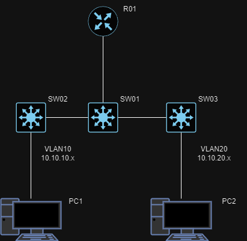
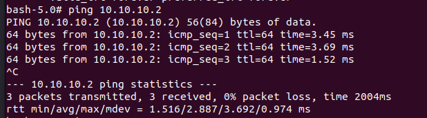
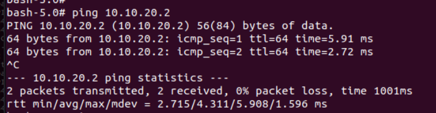

University: [ITMO University](https://itmo.ru/ru/)
Faculty: [FICT](https://fict.itmo.ru)
Course: [Introduction in routing](https://github.com/itmo-ict-faculty/introduction-in-routing)
Year: 2024/2025
Group: K3323
Author: Abdrakhmanov Martin Maratovich
Lab: Lab1
Date of create: 17.09.2024
Date of finished: - 

# Схема работы 

У R01 ip в vlanах 10 и 20 - 10.10.10.2 и 10.10.20.2 соответсвенно. Свитчи получают ip по dhcp. 

# Результаты пингов 
### Ping PC1 --> R01

### Ping PC2 --> R01

