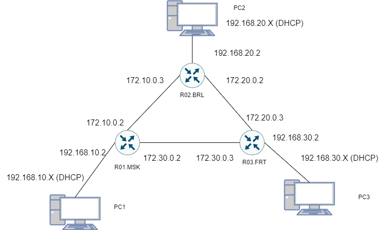
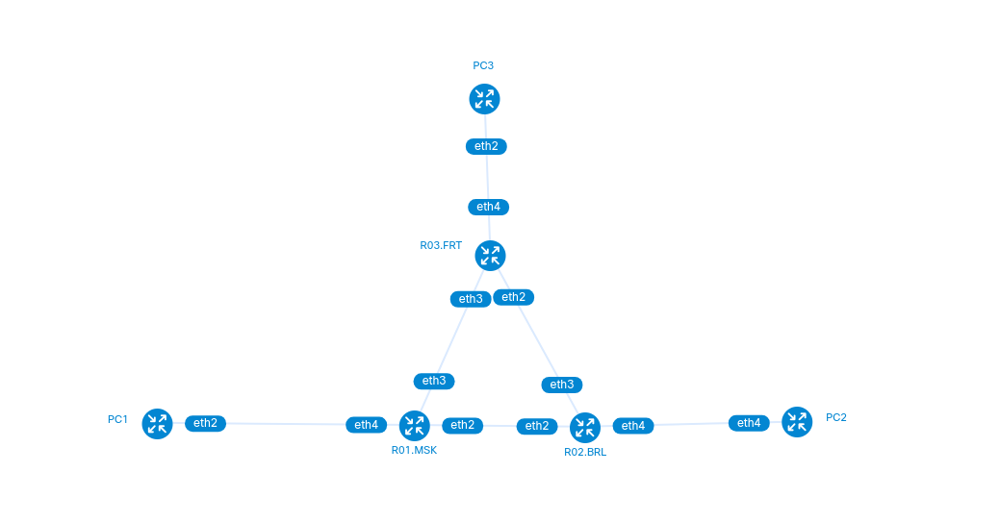
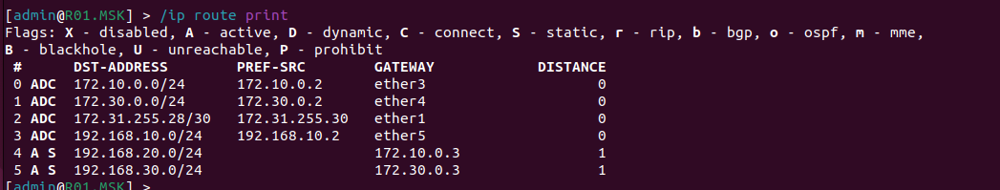
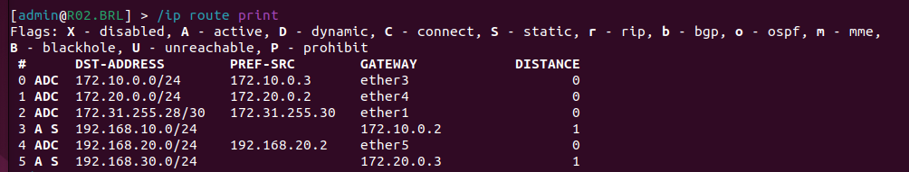
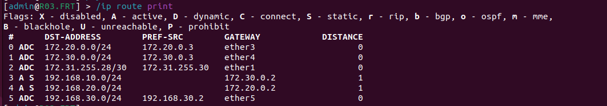
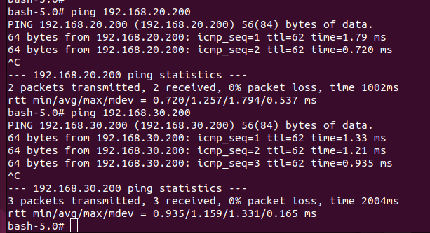
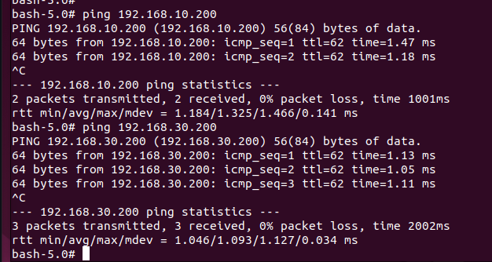
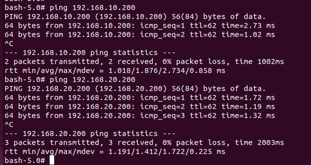

University: [ITMO University](https://itmo.ru/ru/)
Faculty: [FICT](https://fict.itmo.ru)
Course: [Introduction in routing](https://github.com/itmo-ict-faculty/introduction-in-routing)
Year: 2024/2025
Group: K3323
Author: Abdrakhmanov Martin Maratovich
Lab: Lab2
Date of create: 17.09.2024
Date of finished: - 

# Схема работы 

# Таблицы маршрутизации
### R01.MSK

### R02.BRl

### R03.FRT

# Результаты пингов 
### Ping PC1 --> PC2/PC3

### Ping PC2 --> PC1/PC3

### Ping PC3 --> PC1/PC2

