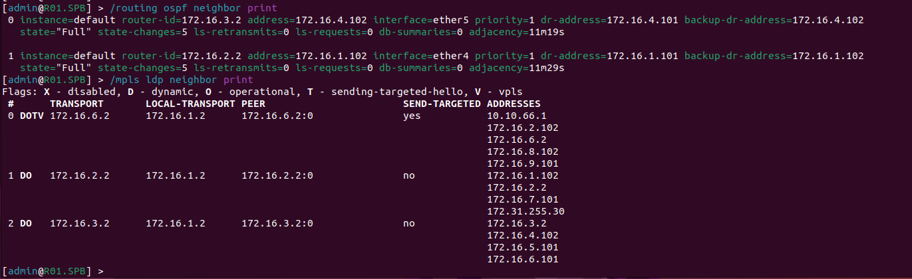
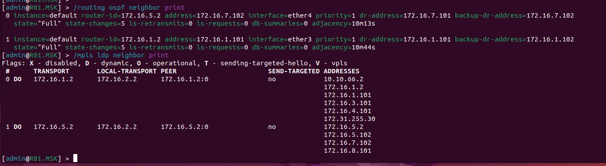
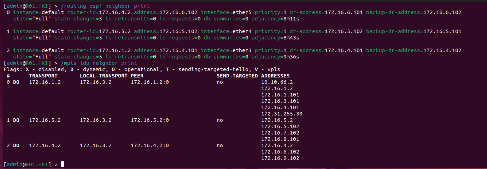
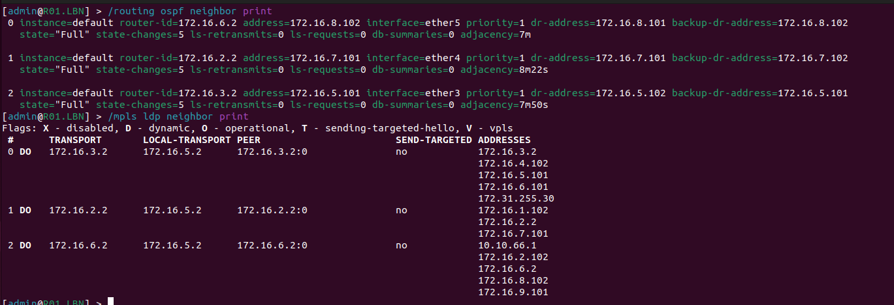
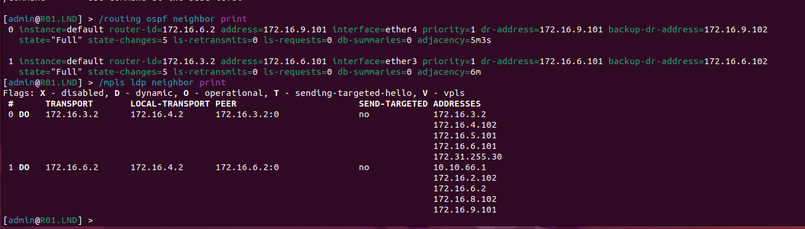
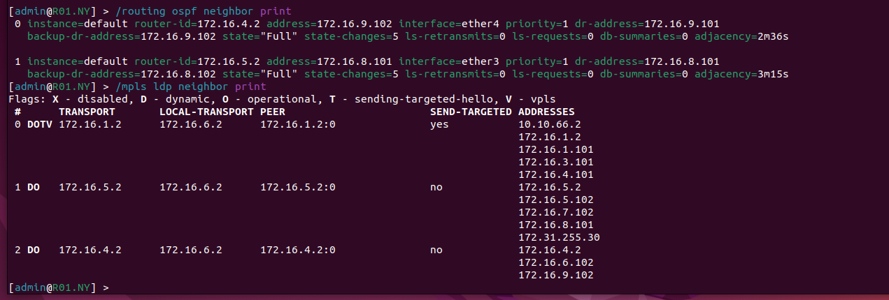
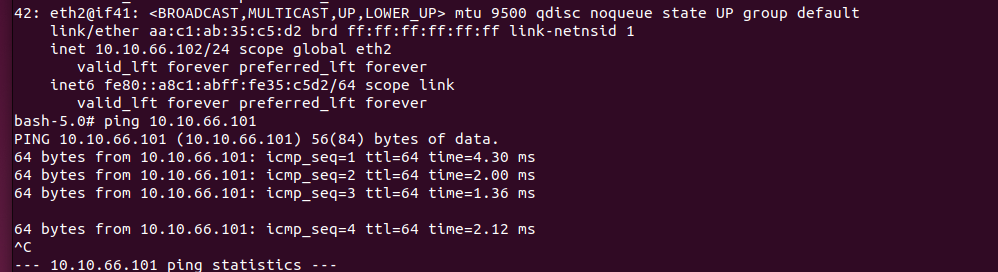
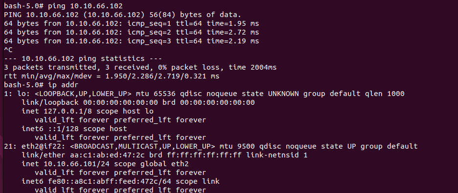

University: [ITMO University](https://itmo.ru/ru/)
Faculty: [FICT](https://fict.itmo.ru)
Course: [Introduction in routing](https://github.com/itmo-ict-faculty/introduction-in-routing)
Year: 2024/2025
Group: K3323
Author: Abdrakhmanov Martin Maratovich
Lab: Lab3
Date of create: 15.10.2024
Date of finished: - 

# Схема работы 

# Статус соседей 
### R01.SPB

### R01.MSK

### R01.HKI

### R01.LBN

### R01.LND

### R01.NY

# Результаты пингов между SGI Prism и PC1 с помощью EoMPLS

### PRISM --> PC1

### PC1 --> PRISM

